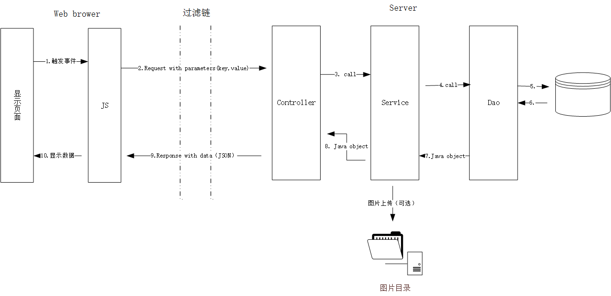

# 技术实现总体技术说明

<!-- TOC -->

- [技术实现总体技术说明](#%E6%8A%80%E6%9C%AF%E5%AE%9E%E7%8E%B0%E6%80%BB%E4%BD%93%E6%8A%80%E6%9C%AF%E8%AF%B4%E6%98%8E)
    - [request && response 图解](#request--response-%E5%9B%BE%E8%A7%A3)
    - [详细描述](#%E8%AF%A6%E7%BB%86%E6%8F%8F%E8%BF%B0)
    - [登录相关的 session 属性](#%E7%99%BB%E5%BD%95%E7%9B%B8%E5%85%B3%E7%9A%84-session-%E5%B1%9E%E6%80%A7)
        - [属性名与默认值](#%E5%B1%9E%E6%80%A7%E5%90%8D%E4%B8%8E%E9%BB%98%E8%AE%A4%E5%80%BC)
        - [登录成功后新值](#%E7%99%BB%E5%BD%95%E6%88%90%E5%8A%9F%E5%90%8E%E6%96%B0%E5%80%BC)
        - [如何使用 session 属性](#%E5%A6%82%E4%BD%95%E4%BD%BF%E7%94%A8-session-%E5%B1%9E%E6%80%A7)

<!-- /TOC -->

## request && response 图解



## 详细描述

1. 页面显示部分
    - 使用技术
        - bootstrap
        - css
        - jsp // 页面上不要出现 java 代码
    - 触发 request 的主要场景
        1. 点击超链接。//这种情况不会经过 Controller，不需编写后台代码。
        1. 提交 form。//form 中元素在提交该表单时会自动封装到 request 中（会刷新页面）。form 中的元素必须要有 `name` 属性，用来在控制层提取元素中数据。
            - Controller 获取参数：`request.getparameter("element name attr")`。
        1. Ajax 请求。//由 JS 发出（不会刷新页面）。Ajax 请求必须手动填充需要随 request 发送到服务器的数据。下面是一个例子
            - 填充数据：`{ "firstName":"John" , "lastName":"Doe" }`
            - Controller 获取参数：`request.getparameter("firstName");`
    - 
1. JS
    - 使用技术  
        - jQuery
    - 主要作用
        - 实现动态页面效果。
        - 发送 Ajax 请求，解析响应数据，对 JSP 文件进行文档操作将数据显示到页面

1. Controller
    - 使用技术
        - Controller 所有类都是 HttpServlet 的子类
        - Gson // JavaObject 转为 JSON 的工具类
    - 主要作用
        - 接受来自客户端浏览器的请求，调用后台 service 相应方法获取需要的数据。一般将 request 直接传给 service。
        - 将结果转为 JSON 格式写入 response。
        - **业务逻辑尽量都交给 service 层处理，Controller 尽量保持短小，起到控制作用即可**
    - 注意事项
        - 命名方式：类名以 Action 结尾。对应 url 为类名首字母小写，并将 Action改为 `.action`。 例：
            - 类名：`GetReceiverInfoAction`
            - url：`/getReceiverInfo.action`

1. service
    - 主要作用
        - 从 request 中获取参数，若数据项超过 3 个，就将这些参数封装到 JavaObject 中，然后传递给 dao 层，否则直接传参即可。
        - 将数据返回给 Controller。
    - 注意事项
        - 为保证事务的原子性，只允许调用 dao 层的一个方法。

1. dao 
    - 主要作用
        - 对数据库进行操作（写入 / 读取）
        - 返回数据给 service。
    - 使用工具
        - 使用 `DBUtil` 获取数据库连接，该工具内部封装了连接池。
        - 需要填充参数的 SQL 语句一律使用 `PreparedStatement`
    - 注意事项
        - [保持事务原子性](https://docs.oracle.com/javase/tutorial/jdbc/basics/transactions.html)。**这个很重要！**

## 登录相关的 session 属性

### 属性名与默认值

```
//管理员相关
1. adminLoginStatus = false      
1. adminId = ..                    // adminLoginStatus = false 时无意义 

//用户相关
1. userLoginStatus = false
1. shopHasOpend = false             // userLoginStatus = false 时无意义
1. username = ..                    // userLoginStatus = false 时无意义
1. nickname = ..                    // userLoginStatus = false 时无意义
1. registrationId = ..              // shopHasOpend = false 时无意义
```

### 登录成功后新值

```
//管理员相关
1. adminLoginStatus = true     
1. adminId = ..                    // 实际 id 

//用户相关
1. userLoginStatus = true      
1. shopHasOpend = true         //若该用户已开店   
1. username = ..               //实际用户名
1. registrationId = ..         //shopHasOpend = false 时无意义
```

### 如何使用 session 属性

- JSP 页面中读取 session 属性

```html
<script type="text/javascript">
    <!-- EL 表达式 -->
    var login = "${sessionScope.userLoginStatus}";

    if (login.match("true") != null) {
        $("#unlogin").hide();
        $("#login").show();
        $("#username").html("${sessionScope.username}<b class='caret'></b>"); 
    } else {
        $("#login").hide();
        $("#unlogin").show();
    }
</script>
```

- Tips: 
    1. 独立的 JS 文件无法直接读取 session 属性，所以要想在 JS 代码中使用这些属性的话，需要将这些属性写到 JSP 页面上，然后 在 JS 文件中获取对应元素中的值，示例如下。
    1. 如果页面中没有合适的位置存放该属性值，那么可以在 JSP 页面中添加一个不显示的 `<p></p>` 标签，示例如下。 

```js
var username = $("#username").html()
```

```html
<p id="registrationId" style='display:none'></p>
```
